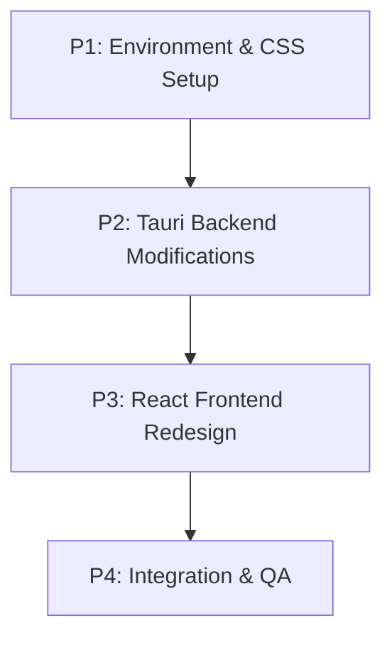

# Listory Plus v2 UI Redesign Implementation Plan

## 1. Plan Overview
This plan implements the "Tauri Native Launcher" architecture to redesign Listory Plus into a macOS Spotlight / uTools style search launcher.
- **Total Phases**: 4
- **Core Agents**: `devops_engineer`, `coder`, `tester`
- **Execution Mode**: Sequential (to handle complex UI and Tauri system-level interactions)

## 2. Dependency Graph

## 3. Execution Strategy

| Phase ID | Description | Agent | Mode | Risk |
| :--- | :--- | :--- | :--- | :--- |
| **P1** | Install Tailwind CSS & Tauri Plugins | `devops_engineer` | Sequential | LOW |
| **P2** | Tauri Window Config & Shortcut Logic | `coder` (Rust) | Sequential | MEDIUM |
| **P3** | Spotlight-style React UI | `coder` (React) | Sequential | MEDIUM |
| **P4** | QA and Final Polish | `tester` | Sequential | LOW |

## 4. Phase Details

### Phase 1: Environment & CSS Setup
- **Objective**: Install Tailwind CSS in the React frontend and add `tauri-plugin-global-shortcut` / `tauri-plugin-tray-icon` to the Rust backend.
- **Validation**: `npm run build` and `cargo check` pass.

### Phase 2: Tauri Backend Modifications
- **Objective**: Update `tauri.conf.json` for frameless/transparent windows. Implement Rust logic for the global shortcut (`Alt+Space`) to toggle window visibility, and intercept window close events to hide instead of exit. Add logic to extract Windows file icons (Base64).
- **Files**: `tauri.conf.json`, `src-tauri/src/lib.rs`.
- **Validation**: Rust backend compiles and registers hotkeys without panicking.

### Phase 3: React Frontend Redesign
- **Objective**: Rewrite `App.tsx` and `App.css` using Tailwind CSS. Create a large, borderless input and a rich list view showing the icon, name, and path. Implement `blur` event listeners to hide the window.
- **Files**: `src/App.tsx`, `src/App.css`.
- **Validation**: The UI renders correctly in a browser environment (`npm run dev`) and handles keyboard navigation (Arrow keys, Enter).

### Phase 4: Integration & QA
- **Objective**: Run the full Tauri application to test the integration between the global shortcut, window transparency, icon fetching, and UI responsiveness.
- **Validation**: `npm run tauri dev` launches successfully; `Alt+Space` works; no visible borders exist.

## 5. File Inventory
- `package.json` / `tailwind.config.js` (Modify/Create)
- `src-tauri/Cargo.toml` (Modify)
- `src-tauri/tauri.conf.json` (Modify)
- `src-tauri/src/lib.rs` (Modify)
- `src/App.tsx` (Modify)
- `src/App.css` (Modify)