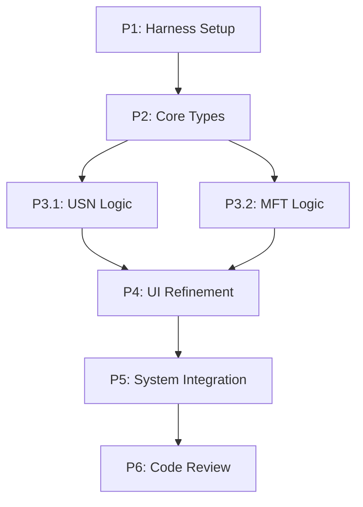

# Listory Plus v2 实施计划 (Implementation Plan)

## 1. 计划概览
本计划旨在通过 Anthropic "Harness" 方法论，并行重构 Listory Plus 为 Tauri v2 架构。

- **总阶段数**: 6
- **核心代理**: `devops_engineer`, `coder`, `tester`, `code_reviewer`
- **执行模式**: 混合模式 (部分阶段并行执行)

## 2. 依赖图 (Dependency Graph)

## 3. 执行策略表 (Execution Strategy)

| 阶段 ID | 描述 | 代理 | 模式 | 风险 |
| :--- | :--- | :--- | :--- | :--- |
| **P1** | 管理员环境与 init.sh 配置 | `devops_engineer` | 顺序 | MEDIUM |
| **P2** | 定义核心数据结构与 Tauri 接口 | `coder` | 顺序 | LOW |
| **P3** | 后端功能开发 (USN & MFT) | `coder` (x2) | **并行** | HIGH |
| **P4** | UI/UX 精致化 (React + CSS) | `coder` | 顺序 | LOW |
| **P5** | 自动化 E2E 验证 | `tester` | 顺序 | MEDIUM |
| **P6** | 最终代码审计 | `code_reviewer` | 顺序 | LOW |

## 4. 阶段详情 (Phase Details)

### Phase 1: 环境就绪 (Harness Setup)
- **目标**: 确保 Rust 工具链可用，创建自动化引导脚本。
- **文件**: `scripts/init.sh`, `.gemini/feature_list.json`。
- **验证**: 执行 `sh scripts/init.sh` 检查管理员权限及工具链。

### Phase 3: 后端功能开发 (Parallel)
- **Batch 3.1 (USN Monitor)**: 实现 `src-tauri/src/index/usn.rs` 的实时更新逻辑。
- **Batch 3.2 (MFT Optimizer)**: 优化 `src-tauri/src/index/mft.rs` 的多驱动器并发扫描。
- **验证**: 每个批次必须通过 `cargo test`。

## 5. 文件清单 (File Inventory)
- `scripts/init.sh` (Create) - 环境引导
- `.gemini/feature_list.json` (Create) - 需求追踪
- `src-tauri/src/index/memory.rs` (Modify) - 内存索引优化
- `src/App.tsx` (Modify) - UI 精致化
- `src/App.css` (Modify) - 极简主义样式

## 6. 执行概况 (Execution Profile)
- **并行阶段**: P3 (包含 2 个子任务)
- **验证方式**: 专用 `tester` 代理运行 `init.sh` 后进行特征测试。
- **管理员权限**: 全程开启，用于操作驱动器和安装环境。
