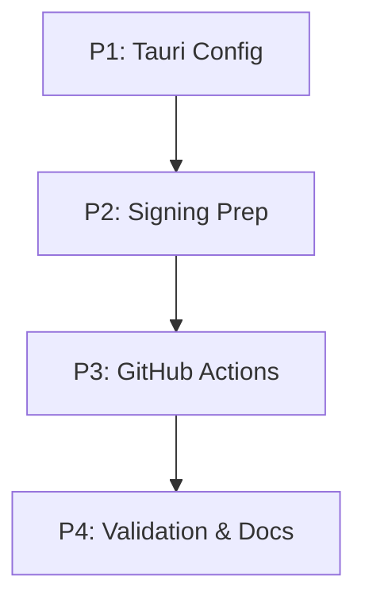

# Listory Plus v2 自动化打包与 Release 实施计划

## 1. 计划概览
本计划旨在构建基于 GitHub Actions 的 CI/CD 流程，实现 Windows 平台的自动打包与发布。

- **总阶段数**: 4
- **核心代理**: `coder`, `devops_engineer`, `tester`, `technical_writer`
- **执行模式**: 顺序执行 (Sequential)

## 2. 依赖图 (Dependency Graph)

## 3. 执行策略表 (Execution Strategy)

| 阶段 ID | 描述 | 代理 | 模式 | 风险 |
| :--- | :--- | :--- | :--- | :--- |
| **P1** | 更新 tauri.conf.json 支持 MSI/NSIS 和 Updater | `coder` | 顺序 | LOW |
| **P2** | 准备签名密钥生成脚本与 Secrets 文档 | `devops_engineer` | 顺序 | LOW |
| **P3** | 编写并提交 release.yml 工作流文件 | `devops_engineer` | 顺序 | MEDIUM |
| **P4** | 最终打包验证与 Release 指南文档 | `tester` / `writer` | 顺序 | LOW |

## 4. 阶段详情 (Phase Details)

### Phase 1: Tauri 打包配置 (Config Refresh)
- **目标**: 更新 Tauri 配置文件以支持双格式打包。
- **文件**: `src-tauri/tauri.conf.json`。
- **验证**: `npm run tauri build -- --dry-run` 检查配置有效性。

### Phase 2: 自动更新与签名准备 (Signing Prep)
- **目标**: 提供生成 `TAURI_SIGNING_PRIVATE_KEY` 的方案，并配置环境变量占位。
- **文件**: `scripts/generate-keys.ps1`。
- **验证**: 脚本能生成对应的私钥和公钥。

### Phase 3: GitHub Actions 工作流定义 (CI/CD)
- **目标**: 实现 `.github/workflows/release.yml` 脚本。
- **文件**: `.github/workflows/release.yml`。
- **验证**: 提交到 GitHub 后 Action 语法检查通过。

## 5. 文件清单 (File Inventory)
- `src-tauri/tauri.conf.json` (Modify) - 配置 bundle 和 updater。
- `scripts/generate-keys.ps1` (Create) - 辅助脚本。
- `.github/workflows/release.yml` (Create) - CI 脚本。
- `RELEASE_GUIDE.md` (Create) - 给用户的操作手册。
